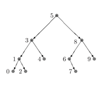

# Árvores

Uma árvore é um conjunto de elementos interligados entre si de forma que um elemento é a **raiz** e os demais se dividem em $n>=0$, subconjuntos disjuntos chamados subárvores.

Os elementos da árvore são chamados de **nós** e as ligações entre eles são chamadas de **arestas**. O nó que não possui pai é dito **nó raiz** e os nós sem filhos são ditos **folhas**. O **grau** de um nó é a quantidade de subárvores que se originam dele.

Se uma árvore for tal que $grau(n)<=2  \forall n \in Árvore$, então dizemos que ela é uma árvore binária.

Níveis são "gerações" de nós na árvore, e a **altura** de uma árvore é o seu maior nível. Em uma árvore binária, um nível $k$ pode ter no máximo $2^k$ nós. O crescimento dos nós, conforme aumentamos o nível, é exponencial.

O  máximo de nós numa árvore de altura $h$ é: $2^0+2^1+...+2^h = 2^{k+1}-1$, pela soma dos termos da PG de razão 2.

Árvores são estruturas de dados não lineares, pois há várias formas distintas de percorrer seus elementos. As três formas padrão são:

- Pré-ordem (raiz-esquerda-direita)
- Em ordem (esquerda-raiz-direita)
- Pós-ordem (esquerda-direita-raiz)

## Varredura esquerda-raiz-direita

Á varredura erd visita:

1. A subárvore esquerda da raiz, em ordem e-r-d
2. A raiz
3. A subárvore direita da raiz, em ordem e-r-d


<div style="text-align: center">
<p>
Figura 1: Ordem de visitação dos nós. Fonte: [1]
</p>
</div>

Implementação:

```c
void erd (arvore r){
    if (r != NULL){
        erd(r->esq);
        printf("%d\n", r->conteudo);
        erd(r->dir);
    }
}
```

As demais varreduras são semelhantes, trocando-se a ordem da recursão.

## Igualdade

Duas árvores são iguais se possuírem os mesmos dados e mesma estrutura. Árvores com os mesmos dados, mas estruturas diferentes, são ditas isomorfas.

## Implementação

A implementação pode ser feita por meio de listas encadeadas ou vetores.

### Lista Encadeada

Cada nó tem a forma:

Obs: Item é um tipo qualquer, que pode ser definido das formas a seguir:
A definição de Item por macro permite a alteração do tipo em tempo de compilação, com a flag:

```shell
    gcc -o  a.out -DItem=float a.c
```

```c
typedef int Item // ou: #define Item int 

typedef struct no {
    Item dado;
    struct no *esq, *dir;
} no;
```

> :material-warning-outline: O uso de listas encadeadas pode diminuir a performance durante a varredura da árvore, pois os nós não estão salvos em posições sequenciais da memória.

### Vetor

Se a raiz está na posição i, o filho esquerdo está na posição `2*i + 1` e o filho direito na posição `2*i+2`. Observe que como uma árvore binária de com `k` níveis tem, no máximo `2^k` nós, sabendo a altura da árvore é possível alocar o tamanho certo do vetor.

A inserção no vetor é mais trabalhosa e pode exigir redimensionamento.
