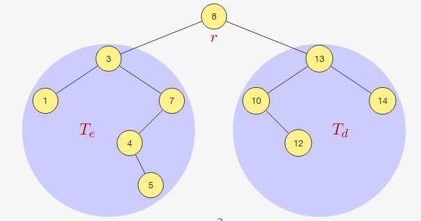

# Árvore Binária de Busca

## Definição

Uma árvore binária tal que cada nó $r$ com subárvores esquerda $T_e$ e direita $T_d$ satisfaz:

- $e<r, \forall\ e \in T_e$

- $d>r, \forall\ d \in T_d$

é uma **árvore binária de busca**.


<div style="text-align: center">
<p>
Figura 1: Exemplo de árvore binária de busca. Fonte: [1]
</p>
</div>

### Estrutura

#### Listas Encadeadas

A árvore é composta de nós com a estrutura abaixo.

```c
#define Item int

typedef struct no
{
    Item dado;
    struct no *esq, *dir;
} no;
```

#### Vetores

A árvore é distribuída em um vetor de forma que dada uma raiz na posição `i`, seus filhos esquerdo e direito estão nas posições `2*i+1` e `2*i+2`, respectivamente.

Uma árvore de `k` níveis terá no máximo `2^k` nós.

A árvore da Figura 1 ocuparia o vetor `v` da seguinte maneira:

```c
v[0] = 8            v[16] = 0
v[1] = 3            v[17] = 0
v[2] = 13           v[18] = 0
v[3] = 1            v[19] = 5
v[4] = 7            v[20] = 0
v[5] = 10           v[21] = 0
v[6] = 14           v[22] = 0
v[7] = 0            v[23] = 0
v[8] = 0            v[24] = 0
v[9] = 4            v[25] = 0
v[10] = 0           v[26] = 0
v[11] = 0           v[27] = 0
v[12] = 12          v[28] = 0
v[13] = 0           v[29] = 0
v[14] = 0           v[30] = 0
v[15] = 0           v[31] = 0
```

<div style="text-align: center">
<p>
Tabela 1: Distribuição da árvore da Figura 1 em um vetor. (Fonte: autor, 2023).
</p>
</div>

As funções que calculam as posições dos pais e filhos podem ser definidas pelas seguintes macros:

```c

#define PAI(n) ((int) n / 2)
#define ESQ(n) (2 * n + 1)
#define DIR(n) (2 * n + 2)

```

O vetor pode ser encapsulado em uma struct contendo também o seu tamanho:

```c
#define item int

typedef struct
{
    item *content;
    int size;
} tree;

typedef tree *p_tree;

void init_tree(p_tree tree, int height)
{
    int size = pow_2(height);
    tree->size = size;
    tree->content = malloc(size * sizeof(item));
    
    for (int i = 0; i < tree->size; i++)
        tree->content[i] = -1;
}
```

## Propriedades

Uma árvore binária de busca satisfaz a seguinte propriedade:

> A impressão dos elementos em um percurso em-ordem (esquerda-raiz-direita) gera uma lista ordenada.

No exemplo da Figura 1, o percurso em ordem gera a seguinte saída: `1, 3, 4, 5, 7, 8, 10, 12, 13, 14`.

O percurso em ordem é feito da seguinte maneira:

```c
void percurso_em_ordem(no r){
    if (r == NULL)
        return;
    percurso_em_ordem(r->esq);
    printf("%d\n", r->dado);
    percurso_em_ordem(r->dir);
}
```

A complexidade do algoritmo de percurso em ordem é $O(n)$, onde $n$ é a quantidade de nós de uma árvore, uma vez que o função é executada $2\cdot n$ vezes.

## Operações - Listas Encadeadas

### Busca

A ideia é semelhante à busca binária, ou o valor procurado está na raiz da árvore, ou é menor, ou é maior. Se for menor, estará na subárvore da esquerda, se for maior, na da direita.

#### Algoritmo recursivo

```c

no *busca_elemento(no *raiz, Item valor)
{ // Escolhe um tipo de varredura e faz a busca.
    // Pré ordem: raiz, esquerda, direita
    if (raiz != NULL)
        if (raiz->dado == valor)
            return raiz;
        else
        {
            no *esq = busca_elemento(raiz->esq, valor);
            if (esq != NULL)
                return esq;
            else
                return busca_elemento(raiz->dir, valor);
        }
    return NULL;
}
```

#### Algoritmo iterativo

```c
no *buscar_iterativo(no *raiz , int chave) {
    while (raiz != NULL && chave != raiz ->chave)
    if (chave < raiz ->chave)
        raiz = raiz ->esq;
    else
        raiz = raiz ->dir;
    return raiz;
}
```

A complexidade da busca em uma árvore de `n` níveis, se a árvore estiver balanceada, é $O(log n)$, e no pior caso a árvore assemelha-se à uma lista encadeada, o que faz a busca ter complexidade $O(n^2)$. Isso ocorre quando os dados estão ordenados, então um novo nó sempre será inserido do mesmo lado, esquerdo, caso decrescente, direito, quando crescente.

> No caso médio, a árvore tende a ser balanceada, já que cada elemento inserido tem 50% de chance de estar à esquerda ou à direita da raiz.

### Inserção

Antes de fazer a inserção, devemos determinar onde inserir o valor, fazendo uma busca por ele. Então, inserimos ele na posição ele deveria estar.

O algoritmo insere na árvore recursivamente e devolve um ponteiro para a raiz da nova árvore.

```c
no *inserir (no *raiz, int chave){
    no *novo;
    if (raiz == NULL) {
        novo = malloc(sizeof(No));
        novo->esq = novo -> dir = NULL;
        novo->chave=chave;
        return novo;
    }
    if (chave < raiz->chave)
        raiz->esq = inserir(raiz->esq, chave);
    else 
        raiz->dir = inserir(raiz->dir, chave);
    return raiz;
}
```

### Mínimo

Basta andar a árvore sempre à esquerda, até encontrar um nó que não tenha filhos a esquerda.

#### Algoritmo Recursivo

```c
no *minimo(no *raiz){
    if (raiz == NULL||raiz->esq == NULL)
        return raiz;
    return minimo(raiz->esq);
}

```

#### Algoritmo Iterativo

```c
no *minimo_iterativo(no *raiz) {
    while (raiz != NULL && raiz ->esq != NULL)
        raiz = raiz ->esq;
    return raiz;
}
```

> O algoritmo para achar o máximo é simétrico.

## Operações - Vetores

### Busca

### Inserção

### Mínimo

<https://www.ic.unicamp.br/~rafael/cursos/2s2018/mc202/slides/unidade18-arvore-de-busca.pdf>
