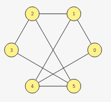
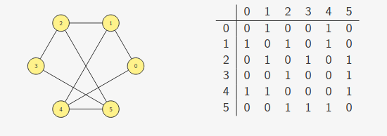

# Grafos

## Definição

Um **grafo** é um conjunto de objetos ligados, por **arestas**, entre si, chamados de **vértices**.


<div style="text-align: center">
<p>
Figura 1: Representação de um Grafo. Fonte:[1]
</p>
</div>

:material-information-outline: Matematicamente, um grafo $G$ é um par ordenado $\left (V,E\right)$ onde:

- V é o conjunto dos vértices do grafo;
  - Exemplo: $V={0, 1, 2, 3, 4, 5}
- E é o conjunto de arestas do grafo;
  - Representamos uma aresta ligando $u, v\in V$ como $\{u,v\}$.
  - Pra toda aresta $\{u,v\}$ tem-se $u\neq v$;
  - Existe no máximo uma aresta $\{u, v\} \in E$;
  - $E=\{\{0,1\}\, \{0, 4\}, \{5, 3\}, \{1, 2\}, \{2, 5\}, \{4, 5\}, \{3, 2\}, \{1, 4\}\}$

Dizemos que os vértices 0 e 4 são **adjacentes**, e 0, 1 e 5 formam a **vizinhança** (conjunto de adjacência) do vértice 4.

## Matriz de Adjacências

Um grafo pode ser representado por uma matriz de adjacências.

Se o grafo tem `n` vértices, teremos vértices numerados de `0` a `n-1` e a matriz com dimensão $n \times n$.

A matriz forma-se da seguinte maneira:

- `adjacencia[u][v] = (u e v vizinhos)? 1 : 0`;


<div style="text-align: center">
<p>
Figura 2: Representação do grafo em uma matriz de adjacências. Fonte: [1]
</p>
</div>

A matriz de adjacência é simétrica, pois $A_{i,j} = A_{j,i} \forall i, j \in [0, n-1]$.

> :material-warning-outline: Ressalvas ao utilizar matrizes:
> A representação do grafo em matriz gera um desperdício de memória, pois bastaria guardar metade dos valores.
> Há um alto consumo de memória, a depender do tamanho do n.
> A matriz guarda as ligações e não ligações entre os vértices, mas poderia guardar apenas as ligações.

### Implementação

A estrutura do grafo com matriz de adjacências `adj` e `n` vértices é dada por:

```c
typedef struct {
    int **adj;
    int n;
} Grafo;

typedef Grafo * p_grafo;

p_grafo criar_grafo(int n);

void destroi_grafo(p_grafo g);

void insere_aresta(p_grafo g, int u, int v);

void remove_aresta(p_grafo g, int u, int v);

int tem_aresta(p_grafo g, int u, int v);

void imprime_arestas(p_grafo g);
```

### Inicialização e destruição

```c
p_grafo criar_grafo(int n){
    int i, j;
    p_grafo g = malloc(sizeof(Grafo));
    
    g->n = n;
    g->adj = malloc(n * sizeof(int *));

    for (i = 0; i < n; i++)
        g->adj[j]=malloc(n*sizeof(int));

    for (i = 0; i <n; i++)
        for (j=0; j<n; j++)
         g->adj[i][j] = 0;

    return g;
}

void destroi_grafo(p_grafo g){
    for (int i = 0; i < g->n; i++)
        free(g->adj[i]);
    free(g->adj);
    free(g);
}
```

### Manipulando arestas

```c
void insere_aresta (p_grafo, int u, int v){
    g->adj[u][v] = 1;
    g->adj[v][u] = 1;
}

void remove_aresta (p_grafo, int u, int v){
    g->adj[u][v] = 0;
    g->adj[v][u] = 0;
}

int tem_aresta(p_grafo g, int u, int v){
    return g->adj[u][v];
}
```

### Lendo e imprimindo um Grafo

```c
p_grafo le_grafo(){
    int n, m, u, v;
    p_grafo g;
    scanf("%d %d", &n, &m);
    g = criar_grafo(n);
    for (int i = 0; i < m ; i++ ){
        scanf("%d %d", &u, &v);
        insere_aresta(g, u, v);
    }
    return g;
}

void imprime_arestas(p_grafo g){
    int u, v;
    for (u = 0; u < g->n; u++)
        for (v = u+1; v < g->n; v++)
            if(g->adj[u][v])
                printf("{%d, %d}\n", u, v);
}
```

## Grau

O grau de um vértice é a quantidade de arestas que saem dele.

Para calcular o grau de um vértice, basta percorrer a quantidade de `1` na linha (ou coluna) correspondente ao vértice.

```c
int grau(p_grafo g, int u){
    int v, grau=0;
    for(v=0; v< g->n; v++)
        grau+= g->adj[u][v] 
    return grau;
}
```

### Elemento com maior grau

```c
int mais_popular(p_grafo g){
    int u, max, grau_max, grau_atual;
    max = 0;
    grau_max = grau(g, 0);
    for (u = 1; u < g->n; u++){
        grau_atual = grau(g,u);
        if (grau_atual > grau_max){
            grau_max = grau_atual;
            max = u;
        }
    }
    return max;
}

```

## Percursos

## Caminho

Um caminho de `s` para `t` em um grafo é:

- Uma sequência sem repetição de vértices vizinhos
- Começando em `s` e terminando em `t`

Formalmente, um caminho de `s` para `t` em um grafo é:

- Uma sequência de vértices $v_0, v_1, ..., v_k$ onde $v_0=s$ e $v_k=t$
- $\{v_i, v_{i+1}\}$ é uma aresta $\forall 0\leq i \leq k-1$
- $v_i\neq v_j \forall 0 \leq i < j \leq k$

$k$ é o comprimento do caminho, a quantidade de vértices do caminho - 1.

## Componentes Conexas

Um grafo pode ser dividido em várias "partes", chamadas de **componentes conexas**.

Um par de vértices está na mesma componente se, e somente se, existe caminho entre eles. Não há caminho entre vértices de componentes distintas.

Um grafo **conexo** tem apenas uma componente conexa.
